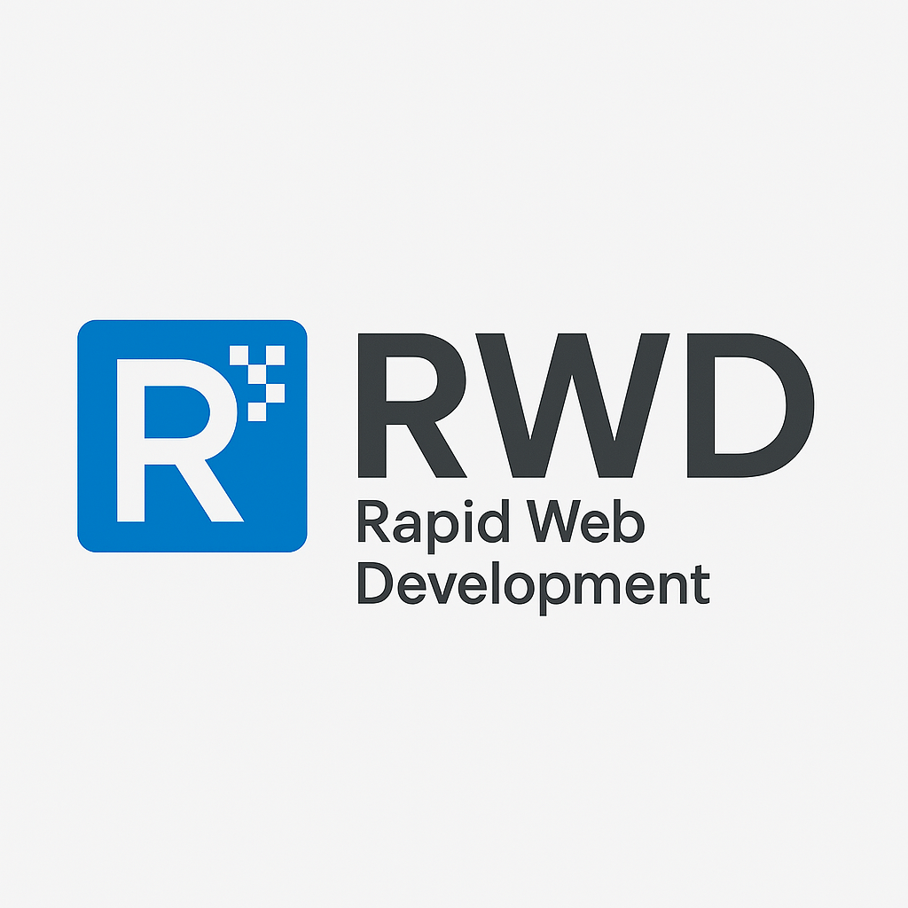
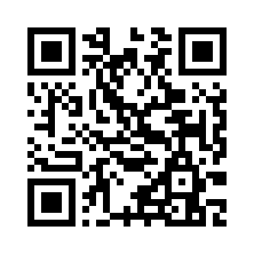

# 🚀 RapidWebDev



## Where AI + Human Ingenuity Builds Your Unique Digital Identity

[](https://opensource.org/licenses/MIT)
[](https://github.com/4citeB4U/RapidWebDev)
[](https://reactjs.org/)
[](https://tailwindcss.com/)
[](https://github.com/4citeB4U/RapidWebDev)

## 📋 Overview

**RapidWebDev** is revolutionizing web development with our unique Single-File Architecture approach, delivering professional, feature-rich websites in just 3-5 days. We combine the analytical power of AI with human creativity to create digital experiences that truly capture your brand's essence.

### 🌟 Why Choose RapidWebDev?

Traditional web development often means:

- Lengthy development cycles (weeks or months)
- Ongoing subscription costs
- Dependency on third-party platforms
- Limited ownership of your digital assets

**RapidWebDev** offers a refreshing alternative:

- Lightning-fast delivery (3-5 days)
- One-time investment with complete ownership
- No recurring subscription fees
- Full access to your website's code
- Freedom to modify and update on your terms

## 🔥 Key Features

### Single-File Architecture

Our innovative approach packs everything into a single HTML file, offering:

- **Blazing Fast Performance**: Minimal HTTP requests mean faster load times
- **Simplified Deployment**: One file to upload, no complex server configurations
- **Enhanced Security**: Reduced attack surface with fewer dependencies
- **Easy Maintenance**: All code in one place for straightforward updates
- **Complete Ownership**: Your entire website in a single, portable file

### 🎭 Interactive Elements

- **Multi-Language Narration**: Built-in accessibility with speech synthesis in 7+ languages
- **Rich Animation Library**: Engaging visual effects that enhance user experience
- **QR Code Integration**: Seamless connection between online and offline experiences
- **Dark Mode Support**: Automatic adaptation to user preferences
- **Responsive Design**: Perfect display on any device size or orientation

### 🛠️ Technical Specifications

- **Frontend Framework**: React for component-based UI development
- **Styling**: TailwindCSS for utility-first styling approach
- **Accessibility**: Web Speech API for narration capabilities
- **Animations**: CSS and React-based animations for smooth interactions
- **AI Integration**: Multiple LLMs for accelerated development and unique solutions

## 📱 Responsive Design

RapidWebDev websites are built with a mobile-first approach, ensuring:

- **Fluid Layouts**: Content adapts seamlessly to any screen size
- **Touch-Optimized**: Interactive elements sized appropriately for touch devices
- **Performance Optimized**: Fast loading even on slower mobile connections
- **Consistent Experience**: Same functionality across all devices

## 🚀 Getting Started

1. Clone the repository:

```bash
git clone https://github.com/4citeB4U/RapidWebDev.git
cd RapidWebDev
```

1. Open `index.html` in your browser to view the site.

1. Explore the code to see our Single-File Architecture in action.

## 🌐 Browser Support

- Chrome (latest)
- Firefox (latest)
- Safari (latest)
- Edge (latest)
- Opera (latest)

## ♿ Accessibility Features

We believe the web should be accessible to everyone:

- **Screen Reader Compatible**: Semantic HTML and ARIA attributes
- **Keyboard Navigation**: Full keyboard support for all interactive elements
- **Reduced Motion**: Respects user preferences for reduced motion
- **High Contrast Mode**: Automatic support for high contrast mode
- **Multilingual Support**: Content narration in multiple languages

## 🔍 Use Cases

RapidWebDev is perfect for:

- **Small Business Websites**: Get online quickly with a professional presence
- **Portfolio Sites**: Showcase your work with engaging interactions
- **Landing Pages**: Convert visitors with optimized, focused content
- **Product Launches**: Create buzz with a standout web presence
- **Personal Branding**: Establish your unique digital identity

## 📞 Contact

Ready for a website that truly reflects your vision? Let's talk!

- **Email**: [agentlee@rapidwebdevelop.com](mailto:agentlee@rapidwebdevelop.com)
- **Phone**: 414-367-6211
- **Website**: [rapidwebdevelop.com](https://rapidwebdevelop.com)

## 📄 License

This project is licensed under the MIT License - see the LICENSE file for details.

---

**© 2023 RapidWebDev. All rights reserved.**


